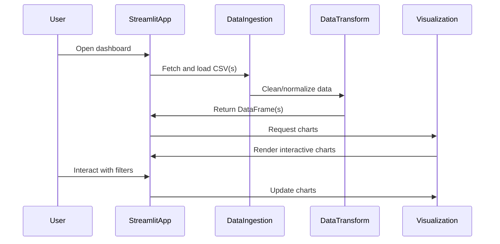
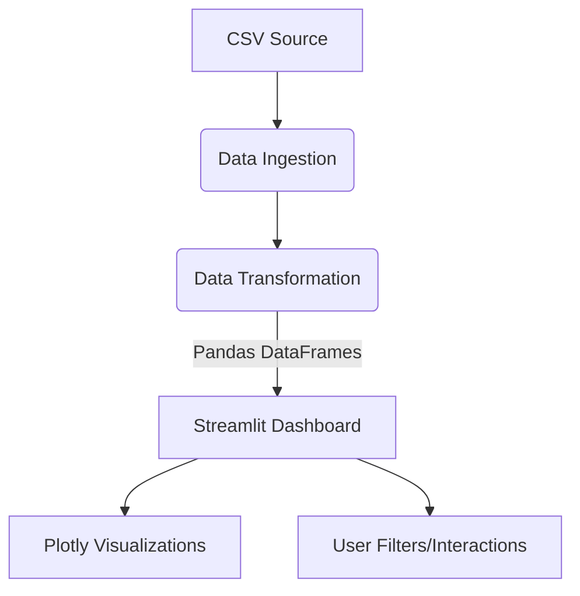

# YC Analytics Dashboard — Technical Specifications

## 1. Project Structure

```
yc_analytics/
│
├── data_ingestion.py      # Download and preprocess CSVs from YC API
├── data_transform.py      # Normalize, clean, and optionally persist data
├── dashboard.py           # Streamlit app; UI, charts, filters
├── visualization.py       # Chart rendering with Plotly
├── config.py              # Configurations (paths, constants)
├── requirements.txt       # Dependencies
└── README.md
```

## 2. Sequence Diagram



## 3. Architecture Diagram



## 4. Pseudocode for Main Files/Objects

### data_ingestion.py

```python
def fetch_csv(url: str, dest_path: str):
    # Download CSV from URL and save to dest_path
    pass

def load_csv(path: str) -> pd.DataFrame:
    # Read CSV into DataFrame, handle missing values
    pass
```

### data_transform.py

```python
def clean_data(df: pd.DataFrame) -> pd.DataFrame:
    # Normalize columns, handle types, filter invalid rows
    pass

def maybe_persist(df: pd.DataFrame, db_path: str = None):
    # Optionally save to SQLite for historical analysis
    pass
```

### visualization.py

```python
def plot_trends(df: pd.DataFrame):
    # Return Plotly line chart for trends over time
    pass

def plot_distribution(df: pd.DataFrame, by: str):
    # Return Plotly bar chart for categorical breakdowns
    pass
```

### dashboard.py

```python
def main():
    # Streamlit app entrypoint
    # Sidebar: file upload or auto-fetch, filter widgets
    # Main panel: render charts from visualization.py
    pass
```

### config.py

```python
CSV_URL = "https://..."
LOCAL_CSV_PATH = "./data/yc_companies.csv"
DB_PATH = "./data/yc_data.db"
```
